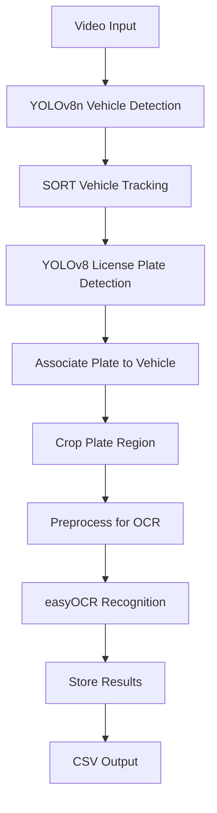
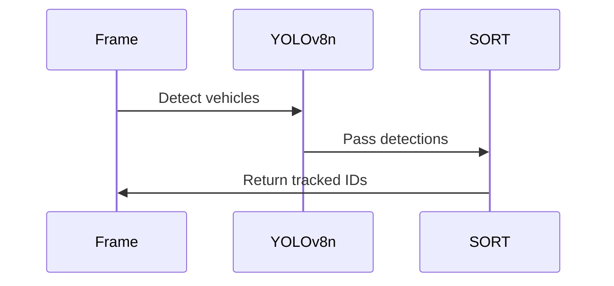
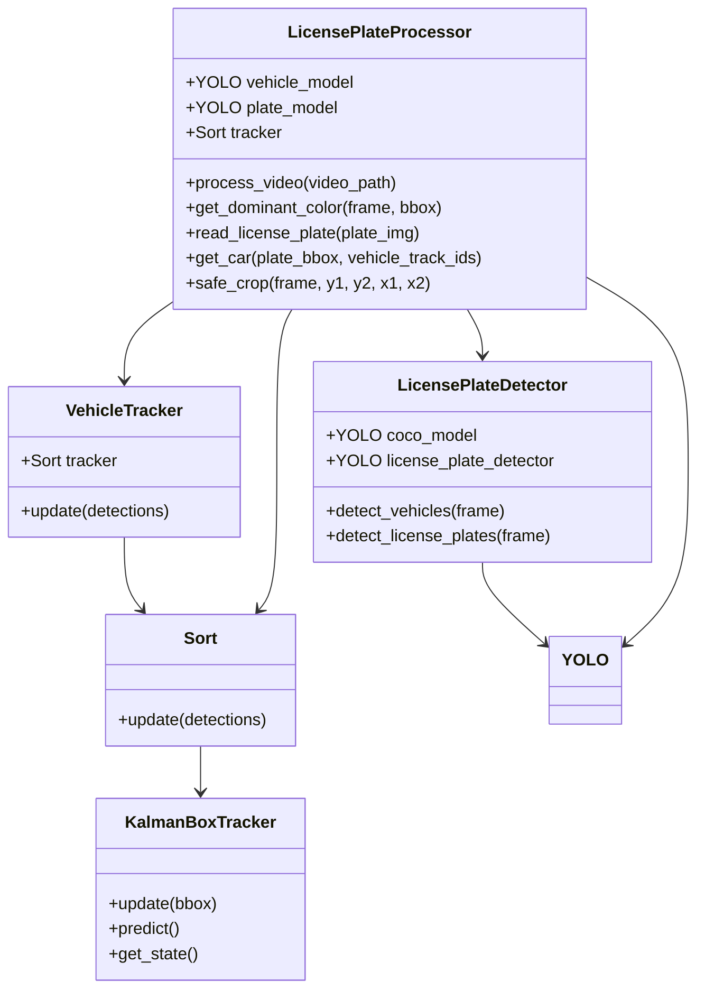
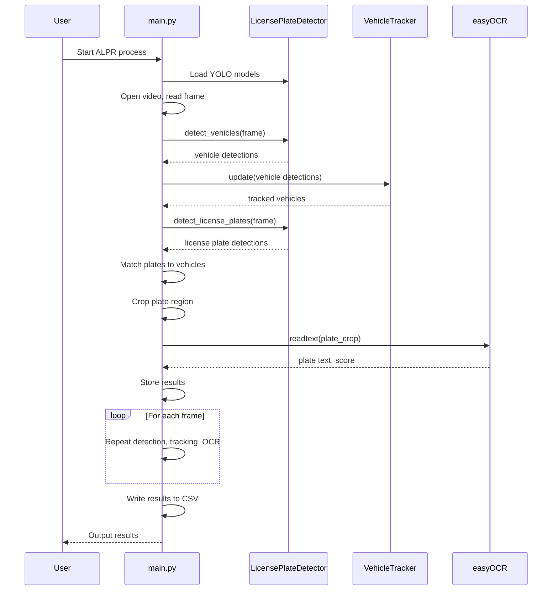
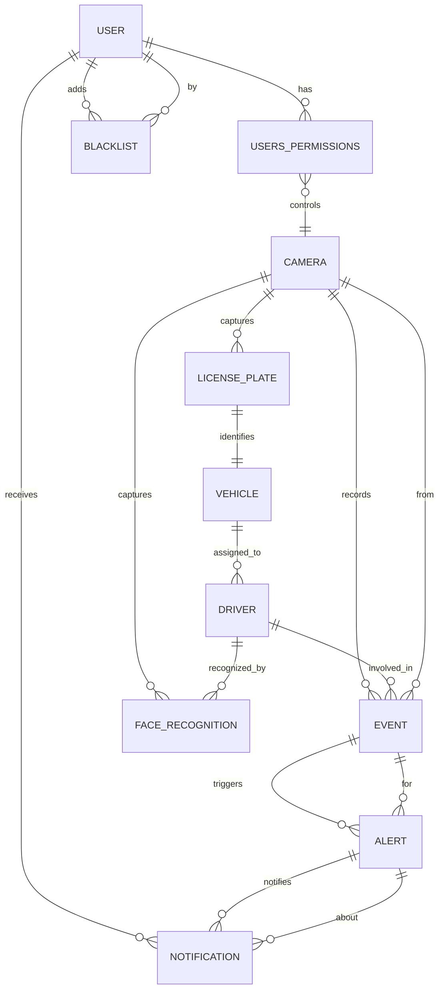
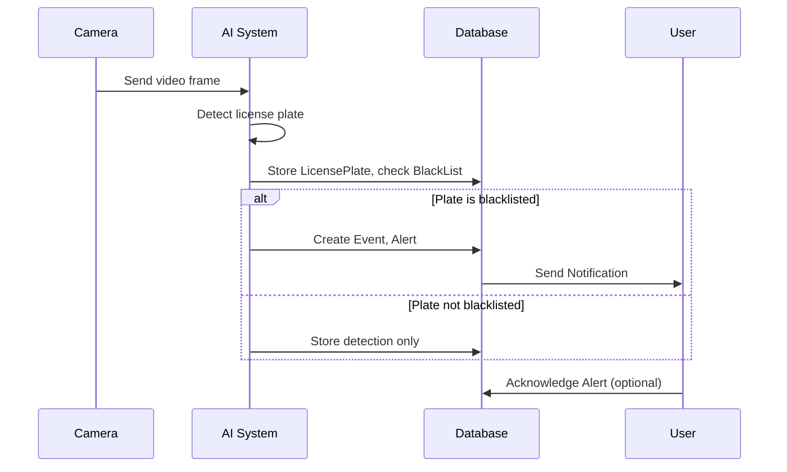

# ALPR Backend Technical Report

---

## 1. System Overview

The backend is a Python-based system for Automatic License Plate Recognition (ALPR) from video streams. The core AI pipeline detects vehicles, tracks them, detects license plates, and recognizes plate numbers using OCR.

---

## 2. High-Level Architecture Diagram



---

## 3. Technologies Used

| Component                 | Technology/Library | Purpose                                 |
| ------------------------- | ------------------ | --------------------------------------- |
| Vehicle Detection         | YOLOv8n            | Detects vehicles in each frame          |
| Vehicle Tracking          | SORT               | Assigns consistent IDs to vehicles      |
| License Plate Detection   | YOLOv8 (custom)    | Detects license plates in each frame    |
| License Plate Recognition | easyOCR            | Reads text from detected license plates |
| Data Output               | CSV, Python        | Stores results for further processing   |

---

## 4. Detailed Pipeline with Code Snippets

### A. Vehicle Detection (YOLOv8n)

Detects vehicles in each video frame.

```python
from ultralytics import YOLO

coco_model = YOLO('yolov8n.pt')
detections = coco_model(frame)[0]
vehicles = [2, 3, 5, 7]  # car, truck, bus, motorcycle
detections_ = [
    [x1, y1, x2, y2, score]
    for x1, y1, x2, y2, score, class_id in detections.boxes.data.tolist()
    if int(class_id) in vehicles
]
```

---

### B. Vehicle Tracking (SORT)

Maintains consistent IDs for vehicles across frames.

```python
from sort import Sort
mot_tracker = Sort()
track_ids = mot_tracker.update(np.asarray(detections_))
```

**Diagram:**


---

### C. License Plate Detection (YOLOv8 Custom Model)

Detects license plates in each frame.

```python
license_plate_detector = YOLO('license_plate_detector.pt')
license_plates = license_plate_detector(frame)[0]
```

---

### D. Association: Plate to Vehicle

Assigns each detected license plate to the correct vehicle using bounding box containment.

```python
def get_car(license_plate, vehicle_track_ids):
    x1, y1, x2, y2, score, class_id = license_plate
    for xcar1, ycar1, xcar2, ycar2, car_id in vehicle_track_ids:
        if x1 > xcar1 and y1 > ycar1 and x2 < xcar2 and y2 < ycar2:
            return xcar1, ycar1, xcar2, ycar2, car_id
    return -1, -1, -1, -1, -1
```

---

### E. License Plate Recognition (easyOCR)

Reads the license plate number from the cropped image.

```python
import easyocr
reader = easyocr.Reader(['en'], gpu=False)
detections = reader.readtext(license_plate_crop_thresh)
for detection in detections:
    bbox, text, score = detection
    # Validate and format text
```

**Preprocessing for OCR:**
```python
license_plate_crop_gray = cv2.cvtColor(license_plate_crop, cv2.COLOR_BGR2GRAY)
_, license_plate_crop_thresh = cv2.threshold(license_plate_crop_gray, 64, 255, cv2.THRESH_BINARY_INV)
```

---

### F. Output Results

Stores results in a dictionary and writes to CSV.

```python
def write_csv(results, output_path):
    with open(output_path, 'w') as f:
        f.write('frame_nmr,car_id,car_bbox,license_plate_bbox,license_plate_bbox_score,license_number,license_number_score\n')
        for frame_nmr in results:
            for car_id in results[frame_nmr]:
                # Write formatted results
```

---

### 4.1 AI System Class Diagram

The following class diagram illustrates the main classes and their relationships in the AI pipeline:



**Explanation:**
- The diagram shows how detection, tracking, and processing classes interact and depend on each other.
- `LicensePlateProcessor` orchestrates the main workflow, using detection and tracking classes.
- `Sort` and `KalmanBoxTracker` are core to the tracking logic.

---

### 4.2 AI Component Activity Diagram

This activity diagram visualizes the step-by-step workflow of the ALPR process:

```mermaid
flowchart TD
    Start([Start]) --> LoadModels[Load YOLOv8n & License Plate Detector]
    LoadModels --> OpenVideo[Open Video File]
    OpenVideo --> ReadFrame[Read Frame]
    ReadFrame --> DetectVehicles[Detect Vehicles (YOLOv8n)]
    DetectVehicles --> TrackVehicles[Track Vehicles (SORT)]
    TrackVehicles --> DetectPlates[Detect License Plates (YOLOv8)]
    DetectPlates --> MatchPlateToCar[Associate Plate to Vehicle]
    MatchPlateToCar --> CropPlate[Crop Plate Region]
    CropPlate --> PreprocessOCR[Preprocess for OCR]
    PreprocessOCR --> OCR[Read Plate (easyOCR)]
    OCR --> StoreResult[Store Result]
    StoreResult --> NextFrame{More Frames?}
    NextFrame -- Yes --> ReadFrame
    NextFrame -- No --> WriteCSV[Write Results to CSV]
    WriteCSV --> End([End])
```

**Explanation:**
- This diagram shows the main steps from model loading to result output, including all AI processing stages.
- The loop continues for each frame until the video ends.

---

### 4.3 AI System Sequence Diagram

The following sequence diagram details the interactions between the main components for each frame:



**Explanation:**
- This diagram illustrates the order and flow of messages between the main script, detector, tracker, and OCR engine for each frame.
- It highlights the modular and sequential nature of the ALPR pipeline.

---

## 5. System Database and Component Interactions

### Key Entities
- **User**: Authenticated user (admin or regular), can receive notifications, add to blacklist, etc.
- **BlackList**: Stores blacklisted license plates (linked to User who added).
- **Notification**: Sent to users, triggered by alerts/events.
- **Alert**: Generated from events (e.g., blacklisted plate detected), can trigger notifications.
- **Event**: Represents a detection or incident (e.g., plate detected, driver behavior).
- **LicensePlate**: Detected plate, linked to vehicle and camera.
- **Vehicle**: Registered vehicle, linked to license plate and driver.
- **Driver**: Person detected, linked to vehicle and events.
- **Camera**: Source of detection, linked to events, plates, drivers.
- **FaceRecognition**: Face recognition results, linked to driver and camera.
- **UsersPermissions**: User's permissions for specific cameras.

### Entity-Relationship Diagram (ERD)



### Component Interactions (with AI System)

#### How the AI System Interacts with the Database

1. **Detection**: AI detects a license plate or driver from a camera feed.
2. **License Plate/Driver Storage**: Detected plates and drivers are stored in `license_plates` and `drivers` tables, linked to the relevant camera.
3. **Blacklist Check**: When a plate is detected, the system checks the `blacklist` table. If found, an `event` and `alert` are generated.
4. **Alert & Notification**: An `alert` is created for the event, and `notification` records are generated for relevant users (e.g., admins).
5. **User Actions**: Admins can add plates to the blacklist, acknowledge alerts, and receive notifications.
6. **Permissions**: Access to camera feeds and control is managed via `users_permissions`.

### Example Sequence: Blacklisted Plate Detection



### Brief on Auth, Blacklist, Notification, Alert

- **Auth**: Managed via the `User` model, with roles (admin/user), password hashing, JWT tokens, and permissions per camera.
- **Blacklist**: Admins can add plates to the `BlackList` table. The AI system checks this table on every detection.
- **Notification**: When an alert is generated (e.g., blacklisted plate detected), a `Notification` is created for relevant users.
- **Alert**: Tied to an `Event` (e.g., detection of a blacklisted plate), can be acknowledged by users.

---

## 5. Core Technologies & Libraries

### Authentication & Communication
| Library          | Version | Purpose                                          |
| --------------- | ------- | ------------------------------------------------ |
| PyJWT           | 2.8.0   | JSON Web Token implementation for secure auth    |
| Flask-SocketIO  | 5.3.6   | Real-time bidirectional communication           |
| Flask-Login     | 0.6.3   | User session management for Flask               |

### Computer Vision & AI
| Library          | Version | Purpose                                          |
| --------------- | ------- | ------------------------------------------------ |
| OpenCV          | 4.8.0   | Image processing and video stream handling       |
| Ultralytics     | 8.0.0   | YOLOv8 implementation for object detection      |
| EasyOCR         | 1.7.1   | Text recognition from license plates            |
| SORT            | 1.4.1   | Multi-object tracking algorithm                 |

### Database & ORM
| Library          | Version | Purpose                                          |
| --------------- | ------- | ------------------------------------------------ |
| SQLAlchemy      | 2.0.0   | SQL toolkit and ORM                             |
| Alembic         | 1.12.0  | Database migration tool                         |
| PostgreSQL      | 15.0    | Primary database system                         |

### API & Web Framework
| Library          | Version | Purpose                                          |
| --------------- | ------- | ------------------------------------------------ |
| Flask           | 2.3.3   | Web application framework                        |
| Flask-RESTful   | 0.3.10  | REST API building tools                         |
| Gunicorn        | 21.2.0  | WSGI HTTP Server for production                 |

### Utilities & Support
| Library          | Version | Purpose                                          |
| --------------- | ------- | ------------------------------------------------ |
| NumPy           | 1.25.0  | Numerical computing and array operations         |
| Pillow          | 10.0.0  | Image processing capabilities                    |
| python-dotenv   | 1.0.0   | Environment variable management                  |
